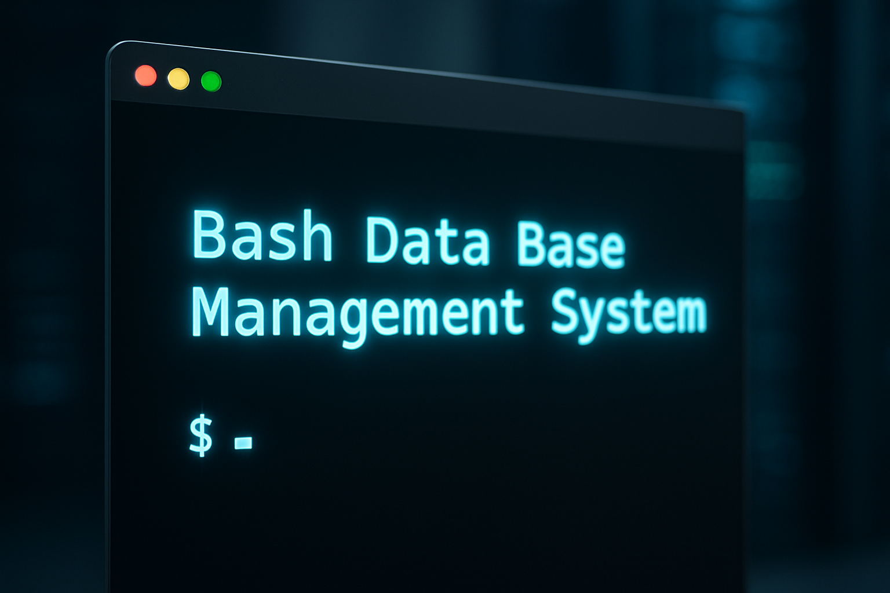

# Bash-DBMS
<div align="center">
  
  
  
  
  A lightweight CLI-based Database Management System built entirely in Bash.
  
  [](https://www.gnu.org/software/bash/)
  [](LICENSE)
</div>

## 🎯 Overview
This project simulates databases and tables using directories and files, providing basic CRUD operations with datatype validation and primary key constraints.

## 📌 Features
- Create, list, connect, and drop databases
- Create, list, and drop tables
- Insert, select, update, and delete rows
- Column datatype checks (int, string, etc.)
- Primary key enforcement
- Menu-driven CLI interface

## 🚀 Getting Started

### Prerequisites
- Bash 4.0 or higher
- Unix-like operating system (macOS, Linux)

### Installation
```bash
git clone https://github.com/albert429/Bash-DBMS
cd Bash-DBMS
chmod +x main-menu.sh databaseMenu.sh
```

### Usage
```bash
./main-menu.sh
```

## 📁 Project Structure
```
Bash-DBMS/
├── main-menu.sh       # Main interface script
├── databaseMenu.sh    # Database operations script
├── databases/         # Data storage (gitignored)
└── assets/           # Project assets
    └── BashDBMSimage.png
```

---

<div align="center">
  Made with ❤️ using Bash
</div>